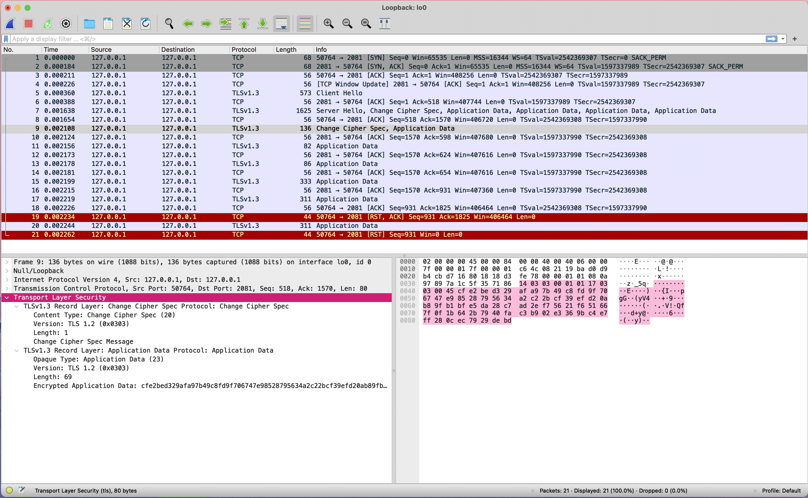

# Overview & Implementation

this project involves enhancing a tcp server written in python to support tls encryption.

the enhancements are done by wrapping the accepted client/server connection in this SSL context to secure it.

enhancements for the server would look like
```python NetFileXferServer.py
context = ssl.create_default_context(ssl.Purpose.CLIENT_AUTH)
context.load_cert_chain(certfile='../../certs/cert.pem', keyfile='../../certs/key.pem')
secureConnection = context.wrap_socket(client_socket, server_side=True)
```

```python NetFileXferServer.py
file_name = secureConnection.recv(file_name_length).decode()
```

enhancements for the client would look like

```python NetFileXferClient.py
context = ssl.create_default_context(ssl.Purpose.SERVER_AUTH)
context.check_hostname = False
context.load_verify_locations("../certs/cert.pem")
secureConnection = context.wrap_socket( client_socket, server_hostname=server_ip)
```
```python NetFileXferClient.py
secureConnection.send(data)
```

### project Structure

<pre>
Project-3-TLSProgramming
├── NetFileXfer
│   ├── <a href="../NetFileXfer/NetFileXferClient.py" title="">NetFileXferClient.py</a>
│   │    Client code for tcp enhanced with tls written in Python.
│   ├── <a href="../NetFileXfer/mountain-lake.jpg" title="">mountain-lake.jpg</a>
│   │    test file to transfer between client and server.
│   ├── server
│   │   └── <a href="../NetFileXfer/server/NetFileXferServer.py" title="">NetFileXferServer.py</a>
│   │        Server code for tcp enhanced with tls written in Python.
│   └── <a href="../NetFileXfer/test.txt" title="">test.txt</a>
│        test file to transfer between client and server.
├── <a href="../README.md" title="">README.md</a>
│    markdown file documenting how to set up and run the applications.
├── <a href="../README.txt" title="">README.txt</a>
│    text file documenting how to set up and run the applications.
├── certs
│   ├── <a href="../certs/cert.pem" title="">cert.pem</a>
│   │    cert for ssl.
│   └── <a href="../certs/key.pem" title="">key.pem</a>
│        key for ssl.
└── report
    ├── <a href="report.md" title="">report.md</a>
    │     A detailed report including: 
    │     Overview of the implementation. 
    │     Screenshots and analysis from Wireshark captures.
    │     Reflection on certificate management.
    ├── <a href="wireShark-after-tls.jpg" title="">wireShark-after-tls.jpg</a>
    │    screenshot of wireshark after tls.
    └── <a href="wireShark-before-tls.jpg" title="">wireShark-before-tls.jpg</a>
         screenshot of wireshark before tls.

</pre>

### Wireshark Captures for TLS-Enabled TCP Echo Server & Client:

### Wireshark Captures for NetFileXfer:
wireshark capture before tls implementation as you can see the packet is being sent in plain text

wireshark capture after tls implementation shows encrypted packet 


### Verifying the Transfer

In the client directory:
```bash input
shasum test.txt 
```
```bash output
2880ad0ceaa3957f0ba001790fa7f8ac704dfb7a  test.txt
```
```bash input
shasum mountain-lake.jpg 
```
```bash output
30c727dab604af2be162a6fef5b98f563a4a6230  mountain-lake.jpg
```
In the server directory:
```bash input
shasum test.txt
```
```bash output
2880ad0ceaa3957f0ba001790fa7f8ac704dfb7a  test.txt
```
```bash input
shasum mountain-lake.jpg 
```
```bash output
30c727dab604af2be162a6fef5b98f563a4a6230  mountain-lake.jpg
```

when comparing the transfered files you can see that the sha1 hashes match meaning that our files transfered from the client to the server are the same files 

### Reflection on certificate management.

using Self-Signed certificates as we did in this assignment should only be 
done when testing or a small scale project only meant to be used at home
